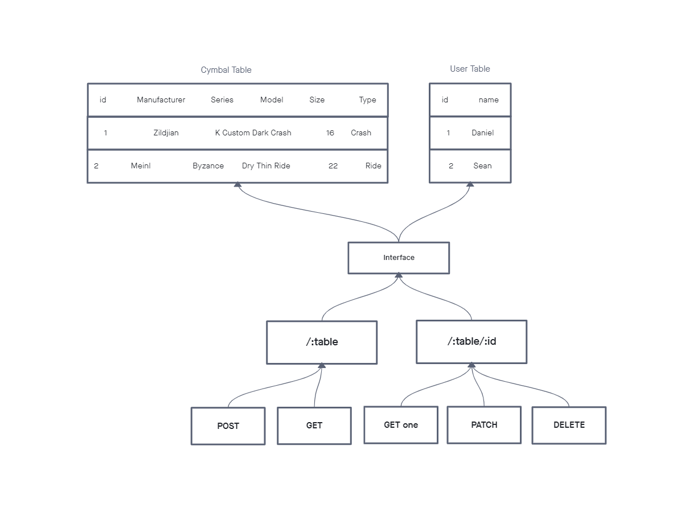

# Project: api-server

## Author: Student/Group Name

## Problem Domain

A basic server to practice CRUD functions on a SQL database and adaptable routing techniques.

## Links and Resources

- [ci/cd](https://github.com/DSFrey/api-server/actions)
- [back-end server url](https://dsfrey-api-server.herokuapp.com/)

## Setup

### `.env` requirements (where applicable)

- `PORT` - Port Number
- `DATABASE_URL` - URL to the running Postgres instance/db

### How to initialize/run your application (where applicable)

- `npm run db:config` then edit the created config file.
- `npm run db:create` to create the database.
- `npm start` to start the application.

### UML

